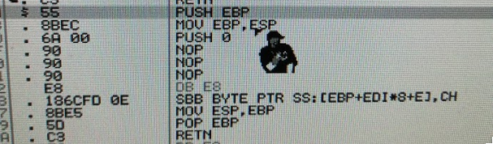

## High Score!

As a quick project for me and my friend Brandon, we decided to upgrade the high-score experience of **Space Cadet Pinball on Windows 98**.

The **hideously era-appropriate** frontend was built to render in IE5.

I built all the native pieces, so reverse engineering the binary and writing a small program to bootstrap the UI.

Brandon built the backend (**Node/Express/sqlite**) as well as the web-based frontend. Creating an SPA compliant with **IE5** is no small feat.

Check out the live scores [here](https://veryjos.com/pinball)!

## Reverse Engineering the Binary

To add a new high score list, there are **three events** that I need to hook:
 - Program launch -> **Inject DLL**
 - View Highscores -> **Display custom frontend**
 - Game over -> **Submit score to backend**

Because we're doing this on a **Windows 98 PC from 1998**, our tools are limited to **OllyDbg 1.1** and not much else!

## Injecting a DLL

Getting your DLL injected is easy! Just configure OllyDbg to pause as soon as the binary starts, and find a nice spot to call your injected subroutine.

First, we stick the **path to the DLL** into the binary. It's typically not a good idea to do this in the binary's **code segment**, but it's fine for our purposes.

We can then call **LoadLibraryA** to inject our DLL, and **GetProcAddress** to get pointers to the functions we expose in our DLL.

## Creating the DLL

We're going to use **multiprocessing** to simplify the approach. We need **two separate binaries**:

  - The injected DLL
  - A **standalone viewer** for the high scores

It's best to keep the injected DLL as **simple as possible**.

The DLL will only launch the viewer, and **block the game thread** until the viewer is closed.

There! Keeping our injected DLL simple lets us avoid a lot of complexity.

We can instead put that complexity in a **totally separate viewer program**, where it's easier to manage.

## Creating the Viewer

To keep things simple, we decided to build a **web-based frontend** instead of something native.

This means that our viewer program will embed an **ActiveX MSIE control**, and all of the business logic will be handled in JavaScript.

When I say quick and easy, I mean this actually took a few hours and a lot of headaches. Documentation for ActiveX in **pure WinAPI and C** is nearly non-existant in 2018, but I eventually clobbered together enough garbage to get something working.

With the viewer binary and DLL done, it's now time to inject some assembly in the right places in order to **bootstrap** these two binaries.

## Hooking "View Highscores"

The next step is to display the frontend when the "**View Highscores**" menu option is clicked.

First, we have to locate the subroutine that's **invoked when the the high-score list is opened**.

Luckily, the "View Highscores" dialog enters its **own blocking event loop**. This means that all we have to do is pause the program while the high-scores list is up, and peek up the call stack.

Yes, that's an **animated Snoop Dogg mouse cursor**. The computer club's Win98 PC is **very 90's**.

We find a call to **ShowDialog**-- which we nuke into a trampoline that loads our custom frontend. The 0 passed to our subroutine indicates that we have no score to submit, and we only want to view.

That lets us jump into **DLL-land**, which in-turn lets us block the game thread while we display the high score list!

## Hooking "Game Over"

The last step is to **submit the player's score** when they lose-- so naturally, we need to be able to find the subroutine that runs when the player loses.

We can use the same method as last time. Lose, submit a high score, pause the debugger while the dialog is open, and then look up the stack to find how we got there.

A quick inspection of the stack leads us here. Setting a breakpoint and stepping through reveals that the score is being written to the **ESI register**. All we have to do is stick a call to a subroutine that invokes the function in our DLL, and then escapes out of the "Game Over" state.

## The Finished Product

At this point, we're done! Here's what it looks like to earn a high-score:

<figure>
  <iframe src="https://gfycat.com/ifr/highlevelelementaryglassfrog" frameborder="0" scrolling="no" allowfullscreen="allowfullscreen" />
</figure>

You can view the high-score list here: [https://veryjos.com/pinball](https://veryjos.com/pinball)

Thanks for reading :)
