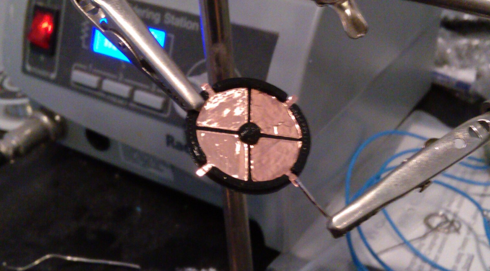

## Results

Here's the finished product:

<figure>
  <iframe src="https://gfycat.com/ifr/IllinformedRipeEmeraldtreeskink" frameborder="0" scrolling="no" allowfullscreen="allowfullscreen" />
</figure>

...and here's how I built them!

## Capacitive Sensing

If you were an early adopter of the iPhone, you might have noticed a huge leap in responsiveness with its touchscreen. The iPhone was one of the first popular devices with a **capacitive touchscreen**.

Despite its advantages, **capacitive sensing** is actually pretty simple, and the simplest variant can be implemented with the **[RC circuit](https://en.wikipedia.org/wiki/RC_circuit)** that you might have learned about in physics class.

As your finger approaches a conductive surface, a **capacitor will be formed between them**.

> image of capacitor between finger and electrode

If you measure the **time** it takes to charge and discharge this capacitor, you can infer the distance to the finger.

This allows you to measure **proximity**, but not **direction**. By using multiple electrodes at known locations, the proximity values can be used to infer an absolute location.

> image of array of electrodes

## Design

Alongside the physical housing, I also created a 2D design for the **capacitive electrodes**. These will be cut out of copper tape.

I chose this design for the touch element for **three reasons**:
  - Easy to fab with my vinyl cutter.
  - I can measure both distance and direction with a minimal design.
  - The edges of the copper tape can be folded over to surface mount to my PCB.

## Fabrication

My 3D printer sucks. Like, it's my own fault, but it really sucks.

It's been **dropped off a table** three times.

  - Auto-leveling probe broke. I calibrate every print by hand.
  - Power supply broke, so I had to repurpose a spare PC power supply.
  - The USB head snapped off. I use a bundle of jumpers instead.

This should really be a testament to the resilience of the Printrbot Simple Metal, but the print quality has suffered since the three major repairs.

Anyway, after getting a print out of her, I moved onto cutting the touch pads. I have a **[Silhouette Portrait](https://www.silhouetteamerica.com/shop/machines/portrait)**, which I'll use to cut the copper tape.

Looks good! I soldered some pins on the edges for testing, and with that we can move onto some **software**.

## Software

My `microcontroller` of choice for this prototype is a **[Teensy LC](https://www.pjrc.com/teensy/teensyLC.html)**. The **Teensy** has all the hardware we need onboard, including capacitance-measuring circuits and a USB controller.

For the **final design**, I'll have to create my own board.

So here's the thing, right? All of this stuff is unfortunately **very relative**. Touches will induce an unknown amount of capacitance, and we have to be able to normalize all of it to figure out a touch position.

To solve this problem, there's a constant **calibration process** that happens in the background. It kind of looks like this:

This solves the two biggest problems I have:

  - Knowing the difference between a hard touch and a touch with great surface area.
  - Normalizing measured capacitance with variable min/max capacitances.

In hindsight, the software could have been simplified with a **different physical design**. However, I'm happy with what I ended up with because it's working quite well!

## Results

After slapping a protective sheet of vinyl on top, I wrote a small app using Python to test out the input over serial.

<figure>
  <iframe src="https://gfycat.com/ifr/IllinformedRipeEmeraldtreeskink" frameborder="0" scrolling="no" allowfullscreen="allowfullscreen" />
</figure>

Works pretty well! But I'd rather see it in a game, so I quickly wrote a **uinput joystick driver** for my input device and checked it out in Retroarch.

<figure>
  <iframe src="https://gfycat.com/ifr/EarnestCrazyCapeghostfrog" frameborder="0" scrolling="no" allowfullscreen="allowfullscreen" />
</figure>

Not bad! Can't wait to have this in my pocket.

Total thickness of the case has been reduced to **2.25mm** :)
