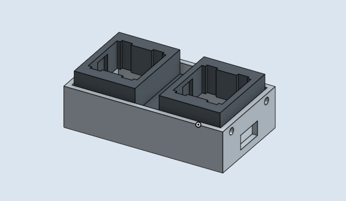
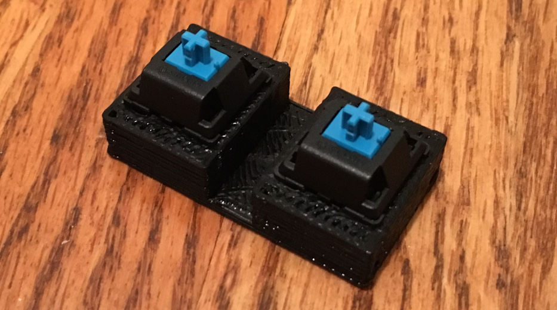
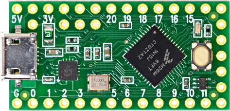
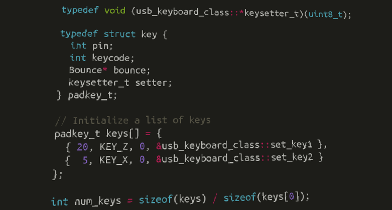
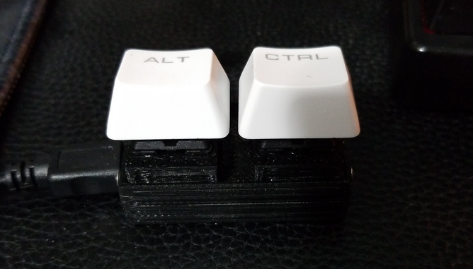
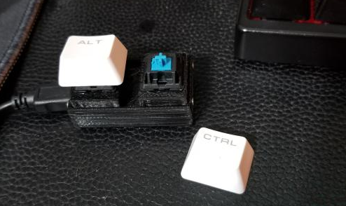

## Secret Santa

Gift-giving is **hard**. I'm pretty into making DIY gifts, because it usually means a lot to the giftee.

My giftee is really into **osu!** a fun rhythm game for the PC.

Most players use a **mechanical keyboard**, but those are large and a pain to drag around.

I decided to make a **micro keyboard** that's easily portable, and uses his favorite blue switches.

**tldr;** [thingiverse](https://www.thingiverse.com/thing:2732851) / [github](https://github.com/veryjos/josukb)

## Design

I'm not much of a CAD expert, but I know my way around the popular tools.

I started by creating a **two-part housing** for the microcontroller. The top and bottom are joined via some self-tapping screws that I had lying around.

A small shelf joined by a **45-degree** arch separates the two parts to prevent overhangs during printing, and allows the wiring to traverse between the two parts.

After a quick trip to my **3D printer**, both parts were printed and ready to go.

You can **print this yourself** you're interested! STLs are available on [Thingiverse](https://www.thingiverse.com/thing:2732851).

## Programming

The fantastic Teensy microcontroller makes things way too easy for prototyping and DIY projects, and has become my go-to for any project that can leverage it.

It's fitted with everything from **four DMA controllers** to a **USB host**, *plus* an incredibly easy to use library for all of the hardware.

Cherry Blues are rated to **debounce** at 5ms, and so after debouncing, the switches are polled and reported to the OS at the polling rate of the PC.

Source is [available here](https://github.com/veryjos/josukb).

## Finishing Up

At this point all we have to do is assemble!

After sanding the parts down, sticking the microcontroller in, dropping some solder joints, and finally screwing the assembly together, we have the **finished product**!

I tested it ingame, because I play a bit of **osu!** too. It worked well and I was able to keep up with my usual scores.

My giftee seems to have enjoyed his gift, and so this project is a success! :~)
