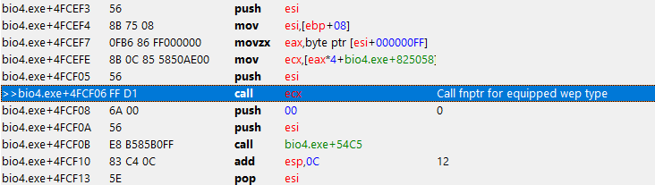

## Tools

Reverse engineering is fun with the right tools! Here's what I'll be using today:

 - [OllyDbg](http://www.ollydbg.de/) - Excellent for **disassembly, analysis, and debugging**.
 - [Cheat Engine](https://www.cheatengine.org/) - Better for **memory search and scripting**.

There are a lot of other great tools in this space, like [Ida](https://www.hex-rays.com/products/ida/), [Radare2](https://rada.re/r/), and [Ghidra](https://ghidra-sre.org/). Today, we're sticking to simple, free tools!

## Where to Start

My goal is to be able to shoot between two arbitrary locations in the game world. That means I must find the **bullet firing subroutine**.

Reverse engineering is usually pretty ad-hoc, so here's one way you could find it:

  - Find the address where the **ammo count** is stored.
  - The game **must** check how much ammo you have before you fire your weapon, to ensure you have non-zero ammo.
  - Set a **memory breakpoint** for when the computer reads the ammo count's address.
  - After the ammo check, the **bullet firing subroutine** will be called soon after.
  - Then, we can just trace through the disassembly with a debugger and it should be easy to tell when we hit the **bullet firing subroutine**!

After a quick memory search, we find the address that stores the ammo count is `0x080973B6`.

In Cheat Engine, I can set a **memory breakpoint** on `0x080973B6`, which will fire when the ammo count is read by the computer.


The first instruction is a **red herring**- we're looking for the ammo check that's executed *only* before firing a bullet. That one seems to happen multiple times per second. Thus, we can guess that this breakpoint is being hit when the game **updates the ammo counter on the HUD**.

With that in mind, let's start the disassembly at the second address in the list because it was only hit once. The third breakpoint was so close that it doesn't really matter. After all, we're just looking for a general starting point to dig deeper.


First, I do a quick trace through to see if anything immediately pops out. **Something does!**



A **jump to a dynamic location** is most likely invoking a function pointer, or virtual function. If you've ever done game programming before, a super-dynamic code path in a place like this should point towards a potential way to change behavior based on the weapon equipped.

This is a great indication that we're on the right track!

## Finding the "Shoot Bullet" Subroutine

From this point on, I'll be using **OllyDbg** for it's superior disassembly and debugging tools.

Starting at the address we found above, it should be easier to find the bullet firing subroutine. Here's one way to do that:
  
  - Disable a call in the current subroutine.
  - Test if the bullet still fires in-game.
  - If the gun didn't fire, you should recurse into the call in your debugger and repeat the process.
  - Repeat until you find the subroutine that gives you the lowest-level control that you need.

Eventually, you'll run into the lowest-level subroutine that is responsible for firing a bullet between two arbitrary locations.

But hold on- just disabling branches and calls is *extremely* dangerous. There could potentially be some **really nasty** side effects like an **invalid stack, register, or heap state**. You have to be aware and fix them on a case-by-case basis.


Disabling the call to this subroutine resulted in Leon firing blanks. That means this subroutine is probably the culprit :)

At this point, it's a matter of reverse engineering the register, stack, and FPU state to figure out how I can call this manually with my own data. Luckily, the FPU stack is empty, so we have less to think about.

A bit lower, we see a pretty notable region:


If we look carefully here, we can see some values being pulled off the stack, and then a call to another subroutine. The SS modifier here means the address within the brackets is treated as **relative to the stack segment**.

You might notice that some of these registers hold integers that are valid within our **stack space**. Pointers, maybe? Let's explore the memory around these alleged pointers and see if we can find some coordinates.

We're looking for a **start and end poisition**. If we put ourselves in the mind of the original programmer, this is a pretty convenient way to describe the **path of a bullet**.

Furthermore, let's parse the memory region as word-aligned, 32-bit floating point values. That's also convenient, and is therefore probably the data/memory layout they chose to represent coordinates in-- especially for the time period that the game came out in.


Notice the **first threee values** here-- these are pretty reasonable values for world-space coordinates. If we move the player around, shoot, and come back to this region of memory, we'll find that these coordinates **change depending on how we move**.

Therefore, we can assume that this is probably the **start position of the bullet's path**.

The end position is stored in a similar manner, and can be found in the same way. The pointer to those values is held in the EAX register. It's just the start position, plus th player's normalized aim vector multiplied by some (very far) arbitrary distance.

## Verifying

Before we crack open the celebratory beer, it's important we **verify our findings**.

First, I'll shoot a bullet and **dump the start and end position** at the addresses we figured out earlier.


```toml
[Start Position]   [End Position]
X =  -4368.40      X = -22177.88
Y = -38687.55      Y = -38687.55
Z =  14068.01      Z =  -1660.24
```

The bullet impact effects in RE4 are pretty mellow, so I highlighted the bullet's hit location with a red circle.

Next, I'll fire a bullet at a **different position**, but inject the previously dumped values into memory right before the subroutine is fired.


And there we go! The bullet hits the **same location** that we aimed at when we fired the first time, but we're clearly not aiming there this time around.

And just like that, we found the subroutine and figured out how it ticks. We can now fire bullets from one arbitrary location to another. This is pivotal for my project :)

Mission accomplished!
